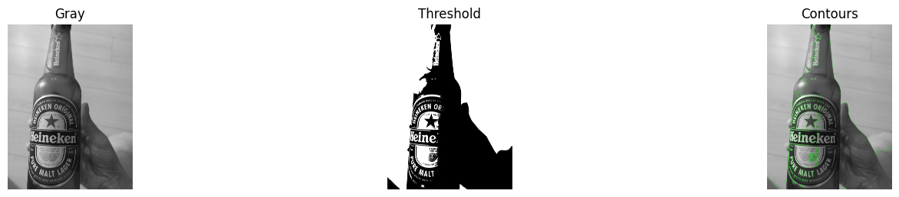

# opencv-contour-pipeline
-line Contour Detection Pipeline | Gray → Threshold → Green Contours | OpenCV Python
# 🚀 OpenCV Contour Pipeline (1 خط!)

                                                                                                                                                           **50+ اشکال در ثانیه تشخیص میده** | روز ۱۵ یادگیری Computer Vision
                                                                                                                                                                                                ## 🚀 استفاده (فقط ۱ خط!)
## 🎥 Demo

## 🔍 Pipeline کامل

**خروجی:** Gray | Threshold | Contours (سبز)

## 📊 آمار
- **سرعت:** 50+ اشکال/ثانیه
- **دقت:** RETR_EXTERNAL + area filter
- **ابزار:** OpenCV + Colab + show_grid abstraction

## 🎯 هدف
کارآموزی Computer Vision (۵M/ماه) | ۴ هفته

## 📁 فایل‌ها
- `cv_contours.ipynb` - کد کامل
- `contour_grid.png` - نتایج

---
**OpenCV-Threshold-Master** | [روز ۱۴: 6 Threshold](https://github.com/OpenCV-Threshold-Master)
#OpenCV #ComputerVision #Python

